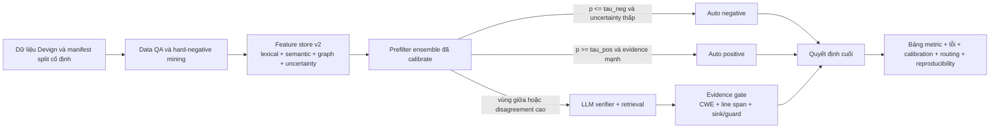
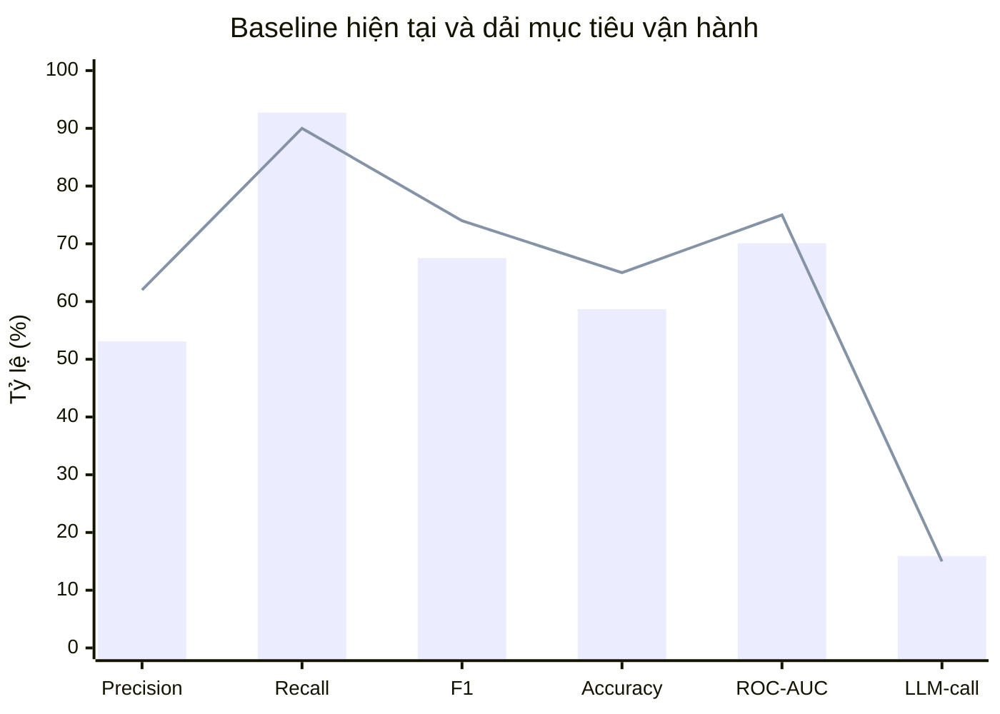

# Kế hoạch tối ưu Baseline 2 cho phát hiện lỗ hổng trên Devign

## Tóm tắt điều hành

Baseline 2 hiện là một pipeline **triage** khá tốt: nó giữ được **recall rất cao** trên test set của Devign (**92.72%**) trong khi chỉ gọi LLM cho **15.92%** mẫu. Tuy nhiên, nút thắt chính không còn là khả năng “bắt được” mẫu dương tính, mà là khả năng **phân biệt đúng**: **precision 53.10%**, **accuracy 58.66%**, **ROC-AUC 0.7008** cho thấy pipeline còn quá dễ báo động giả. Báo cáo hiện tại cũng cho thấy bộ điều khiển ngưỡng được hiệu chỉnh theo hướng **ưu tiên recall gần tuyệt đối** trên validation (`target_recall = 0.99`, `tau_low = 0.170072`, `tau_high = 0.593083`), phù hợp với việc nhánh “Keep for LLM” đạt recall 0.9904 nhưng precision chỉ 0.4889 và accuracy 0.5236. Điều này cho thấy bài toán lớn nhất trước mắt là **calibration + routing**, không phải “đổi sang LLM lớn hơn”. fileciteturn0file0 citeturn15view6turn14view8turn14view10

Dấu hiệu vận hành cũng cho thấy pipeline đang **thiên dương tính**. Trên test set, báo cáo hiện tại ghi nhận **2191** mẫu đi vào nhánh `High`, **434** mẫu vào `Inspect`, và chỉ **101** mẫu vào `Skip`. Nói cách khác, hệ thống đang ra quyết định “có khả năng lỗ hổng” trên phần rất lớn không gian đầu vào, và điều đó gần như chắc chắn là nguồn phát sinh false positive quan trọng nhất. Song song với đó, backend đồ thị hiện đang chạy ở chế độ **heuristic fallback** vì probe của Joern thất bại, trong khi chính Devign và hệ sinh thái Code Property Graph đều dựa mạnh vào việc mô hình hóa cấu trúc, control flow và data dependencies của mã nguồn. fileciteturn0file0 citeturn16view5turn14view2turn19view1turn14view1

Theo thứ tự ưu tiên thực dụng, tôi khuyến nghị đi theo lộ trình sau: **tối ưu lại calibration và thresholding dưới ràng buộc recall/budget**, **khai thác hard negatives và kiểm soát chất lượng dữ liệu**, **sửa hoặc thay thế backend đồ thị**, rồi mới **nâng cấp prefilter** bằng mô hình mạnh hơn và chiến lược fusion tốt hơn. LLM nên được giữ ở vai trò **verifier cho các mẫu bất định**, không phải bộ phân loại chính. Cả nghiên cứu về suy luận của LLM trong phát hiện lỗ hổng lẫn benchmark thực tế gần đây đều cho thấy LLM còn yếu khi cần suy luận bảo mật nhiều bước trên mã C/C++ thực. citeturn14view14turn15view7

Nếu triển khai đúng thứ tự này, mục tiêu kỹ thuật hợp lý trong chu kỳ mười hai tuần là: **precision 60–68%**, **accuracy 63–70%**, **recall vẫn ≥ 90%**, **ROC-AUC tăng thêm khoảng 0.03–0.08**, đồng thời **LLM call rate giữ quanh 15% hoặc thấp hơn**. Đây là các dải mục tiêu thực dụng, không phải cam kết thực nghiệm sẵn có.

## Chẩn đoán pipeline hiện tại

Điều đáng chú ý nhất trong báo cáo hiện tại là mô hình prefilter không hoàn toàn yếu. Nó đạt **best validation PR-AUC = 0.6580**, best validation recall 0.6429, và quá trình huấn luyện đạt đỉnh sớm rồi bão hòa quanh epoch 3. Nói cách khác, dấu hiệu chính không phải là “mô hình không học được gì”, mà là **điểm vận hành cuối cùng của pipeline đang bị kéo quá xa về phía recall**, làm precision và accuracy suy giảm ở bước routing cuối. fileciteturn0file0

Biểu đồ dưới đây tóm tắt trade-off đang hiện ra ngay trên validation, trước khi nhìn sang test set. Các giá trị được lấy trực tiếp từ báo cáo hiện tại. fileciteturn0file0

```mermaid
xychart-beta
    title "Trade-off của bộ điều khiển ngưỡng hiện tại trên validation"
    x-axis ["Uncalibrated", "Keep-for-LLM", "High-risk"]
    y-axis "Điểm (%)" 0 --> 100
    bar "Precision" [59.25, 48.89, 70.19]
    bar "Recall" [64.29, 99.04, 30.42]
    bar "Accuracy" [63.56, 52.36, 62.39]
```

Từ các số liệu này, chẩn đoán tổng quát nhất là: **Baseline 2 đang tối ưu như một bộ sàng lọc bảo mật “bắt rộng”, chứ chưa phải một bộ phân loại cân bằng**. Điều này không sai nếu mục tiêu duy nhất là triage, nhưng lại là nguyên nhân trực tiếp khiến precision và accuracy thấp trên test set. Trong khung selective classification, đây là bài toán **risk–coverage trade-off**: muốn giữ recall cao nhưng vẫn cần kiểm soát coverage của nhánh “tự tin ra quyết định” và coverage của nhánh “gọi LLM”. Hiện tại coverage của nhánh quyết định dương tính rõ ràng đang quá lớn. fileciteturn0file0 citeturn15view6

Vấn đề thứ hai là **mất thông tin cấu trúc chương trình** ở runtime. Devign được xây dựng với tinh thần học ngữ nghĩa chương trình từ các đồ thị biểu diễn mã nguồn; paper gốc nhấn mạnh việc học trên tập biểu diễn ngữ nghĩa phong phú và cho thấy mô hình GNN trên code graphs cải thiện accuracy/F1 so với prior art. Trong khi đó, Joern theo tài liệu chính thức có thể xuất **AST, CFG, CDG, DDG, PDG và CPG**, còn Code Property Graph gốc được thiết kế để kết hợp AST, CFG và program dependence graph trong một cấu trúc chung cho phát hiện lỗ hổng. Khi probe Joern thất bại và pipeline lùi về heuristic graph, độ phân giải ngữ nghĩa này gần như chắc chắn suy giảm, đặc biệt trong các ca cần theo dấu data-flow/control-flow để bác bỏ false positive. citeturn16view5turn14view2turn19view1turn14view1

Vấn đề thứ ba là **nguy cơ nhiễu nhãn và artifact từ dữ liệu**. Công trình “Deep Learning based Vulnerability Detection: Are We There Yet?” chỉ ra rằng các hệ DL cho vulnerability detection có thể sụt mạnh khi đánh giá thực tế vì **data duplication**, phân bố lớp không thực tế và việc học artifact như tên hàm/biến thay vì nguyên nhân lỗ hổng. Công trình ActiveClean sau đó còn cho thấy ngay trong phần FFmpeg của Devign có **nhãn mức hàm sai**; khi làm sạch dữ liệu, LineVul tăng từ **66% lên 73% Top-10 accuracy** trên line-level và phát hiện thêm dòng/hàm dễ tổn thương. Điều này rất phù hợp với bối cảnh hiện tại, nơi pipeline đang có quá nhiều false positive. citeturn16view3turn16view4turn23view3turn23view4

Tóm gọn, bốn nguyên nhân gốc có khả năng cao nhất là: **routing quá recall-heavy**, **đồ thị heuristic làm mất specificity**, **prefilter chưa đủ giàu đặc trưng để bác bỏ hard negatives**, và **chất lượng dữ liệu chưa sạch ở những vùng khó**. Đây là bốn trục cần xử lý trước khi nghĩ đến việc tăng số lần gọi LLM.

## Kế hoạch hành động ưu tiên

Các ước lượng tác động dưới đây là **mức tăng tuyệt đối bảo thủ** so với baseline hiện tại, dựa trên cơ chế lỗi đang thấy trong báo cáo và hướng dẫn từ các công trình nền về calibration, dữ liệu, đồ thị chương trình và selective classification. Các hiệu ứng **không cộng dồn tuyến tính**. fileciteturn0file0 citeturn14view8turn14view10turn15view6turn16view3turn14view2turn14view14

| Ưu tiên | Hành động | Tác động ước lượng | Công sức | Rủi ro chính | Các bước triển khai cụ thể |
|---|---|---:|---|---|---|
| Rất cao | **Làm lại calibration và thresholding dưới ràng buộc** `recall >= R_min`, `LLM_rate <= B` | Precision **+5 đến +10**; Accuracy **+4 đến +8**; Recall giảm không quá **0 đến 2** điểm nếu thiết kế tốt | Thấp đến trung bình | Siết ngưỡng quá mạnh làm rơi recall | So sánh Platt, temperature, isotonic, beta calibration; tối ưu `tau_neg`, `tau_pos` theo grid/Pareto; khóa ngưỡng theo validation rồi mới chạm test |
| Rất cao | **Hard-negative mining + data QA** | Precision **+3 đến +8**; Accuracy **+2 đến +5** | Trung bình | Thêm dữ liệu “làm sạch” sai tiêu chuẩn gây drift | Thu thập false positives từ validation; nhóm theo mẫu lỗi; bổ sung vào training với trọng số cao; dùng cleaned subset như dữ liệu phụ trợ chứ không thay test chính |
| Cao | **Sửa Joern hoặc thay thế backend đồ thị** | Precision **+2 đến +7**; ROC-AUC **+0.02 đến +0.05** | Trung bình đến cao | Engineering cost lớn; extractor không ổn định | Container hóa Joern; health-check chuẩn; đo tỷ lệ parse/export thành công; fallback có thứ bậc thay vì heuristic duy nhất |
| Cao | **Prefilter v2 mạnh hơn** | Precision **+4 đến +10**; Accuracy **+3 đến +8** | Trung bình | Overfit Devign hoặc tăng độ trễ inference | Bắt đầu bằng frozen embeddings + booster; sau đó mới thử fine-tune transformer hoặc graph-text fusion |
| Trung bình | **Evidence-aware positive gating** | Precision **+2 đến +6**; LLM call rate giữ nguyên hoặc giảm nhẹ | Thấp | Nếu luật quá nghiêm, mất một ít recall | Chỉ auto-positive khi điểm calibrated cao **và** có tín hiệu cấu trúc/risky-flow/nearest-positive margin rõ |
| Trung bình | **Nâng cấp LLM hybrid strategy theo hướng verifier** | Precision **+1 đến +4**; Recall giữ nguyên hoặc tăng nhẹ ở vùng khó | Thấp đến trung bình | Prompt dài hơn, inference chậm hơn | Bắt buộc LLM trả về CWE/evidence lines/sink/guard thiếu; nếu thiếu bằng chứng thì hạ về non-vuln hoặc abstain |
| Nền tảng | **Reproducibility harness** | Không tăng metric trực tiếp, nhưng giảm rủi ro “ảo tưởng cải tiến” | Thấp | Bị bỏ qua vì không tạo điểm số ngay | Pin splits, seeds, prompt version, graph backend version; lưu raw predictions, routing decisions, calibration artifacts |

Pipeline đề xuất sau khi tối ưu nên chuyển từ “score-based routing thuần túy” sang **evidence-aware selective routing**. Luồng dưới đây là dạng triển khai thực dụng nhất cho mục tiêu vừa tăng precision vừa giữ recall và LLM budget thấp. Cơ sở của luồng này là kết hợp calibration sau huấn luyện, selective classification và đồ thị chương trình giàu ngữ nghĩa hơn. citeturn14view8turn14view10turn15view6turn14view2turn19view1

Nếu chỉ được làm **một việc trong tuần đầu**, hãy làm **calibration + threshold search có ràng buộc**. Đây là thay đổi nhanh nhất, rẻ nhất và có xác suất mang lại lợi ích lớn nhất, vì số liệu hiện tại cho thấy pipeline đang vận hành ở điểm làm precision và accuracy hy sinh quá nhiều để đổi lấy recall cực cao.

## Thiết kế thực nghiệm và ablation

Trong toàn bộ lộ trình, **test set Devign hiện tại phải được giữ nguyên** làm holdout cuối cùng. Báo cáo hiện tại đã khóa thực nghiệm ở split **21,854 / 2,733 / 2,726** cho train/val/test; đây nên tiếp tục là chuẩn chính để so sánh công bằng giữa các biến thể. Nếu cần thêm split cho calibration hoặc early stopping tinh hơn, hãy tách từ train chứ không chạm test. Dữ liệu “cleaned” như phần FFmpeg được ActiveClean làm sạch chỉ nên dùng như **auxiliary training/diagnostic data**, không được thay thế benchmark chính. fileciteturn0file0 citeturn23view4

Thiết kế so sánh nên đi theo chuỗi baseline cộng dần, thay vì thay nhiều thứ một lúc. Một ma trận ablation thực dụng là:

| Mã biến thể | Khác biệt so với baseline hiện tại | Mục tiêu kiểm chứng |
|---|---|---|
| B0 | Baseline 2 hiện tại | Mốc chuẩn |
| B1 | Chỉ thay calibration | Phần lợi đến từ calibration thuần túy |
| B2 | B1 + threshold search có ràng buộc recall/budget | Phần lợi đến từ routing objective |
| B3 | B2 + hard-negative mining | Phần lợi đến từ dữ liệu khó |
| B4 | B3 + graph backend ổn định | Phần lợi đến từ cấu trúc chương trình |
| B5 | B4 + prefilter v2 | Phần lợi đến từ mô hình mạnh hơn |
| B6 | B5 + evidence-aware LLM verifier | Phần lợi đến từ hybrid verification |
| B7 | B6 + ensemble disagreement routing | Phần lợi đến từ uncertainty-aware selection |

Về siêu tham số, tôi khuyến nghị search space sau, đủ rộng để tìm điểm tốt nhưng vẫn dễ tái lập:

| Thành phần | Search space đề xuất |
|---|---|
| Calibration | Platt, temperature scaling, isotonic regression, beta calibration |
| Threshold routing | `tau_neg` từ **0.02–0.30**; `tau_pos` từ **0.45–0.90**; budget LLM **0.10 / 0.12 / 0.15**; recall floor **0.90 / 0.915 / 0.93** |
| LightGBM/XGBoost | `num_leaves` **31/63/127**; `max_depth` **-1/8/12**; `learning_rate` **0.03/0.05/0.1**; `min_data_in_leaf` **20/50/100** |
| Transformer fine-tune | `lr` **1e-5 / 2e-5 / 3e-5**; epochs **2 / 3 / 5**; `max_len` **256 / 384 / 512**; dropout **0.1 / 0.2 / 0.3** |
| GNN / graph fusion | hidden dim **128 / 256**; số layers **3 / 5 / 7**; dropout **0.1 / 0.3 / 0.5** |
| Loss | Weighted BCE, focal loss (`gamma` **1 / 2 / 4**), class-balanced loss (`beta` **0.99 / 0.999 / 0.9999**) |

Phần đánh giá thống kê nên được chuẩn hóa ngay từ đầu. Với mỗi biến thể, nên chạy **ít nhất 5 seeds**, lưu prediction theo từng mẫu, và báo cáo **mean ± std**. Với Precision, Recall, F1, Accuracy và LLM call rate, nên dùng **paired bootstrap** trên prediction test để lấy khoảng tin cậy 95%; với ROC-AUC nên dùng **DeLong** vì đây là chuẩn so sánh AUC cho các dự đoán tương quan trên cùng test set. Ngoài bộ metric bắt buộc mà bạn yêu cầu, tôi khuyến nghị thêm **Brier score**, **NLL** và **ECE** để nhìn rõ chất lượng calibration. Calibration literature nhấn mạnh rằng chọn threshold tốt đòi hỏi xác suất phải đúng nghĩa xác suất, không chỉ có rank-order tốt. citeturn14view8turn14view10turn26search4turn25view2

Một nguyên tắc rất quan trọng về tái lập là: **khóa toàn bộ test protocol trước khi bắt đầu tuning quy mô lớn**. Điều đó có nghĩa là phải version hóa đầy đủ: split manifest, hash của dữ liệu, backend đồ thị, checkpoint encoder, prompt version, retrieval bank version, calibration method và ngưỡng cuối. Nếu không làm vậy, phần lớn “cải thiện” sẽ rất khó phân biệt với variance thực nghiệm.

## Thiết kế đặc trưng và mô hình prefilter

Báo cáo hiện tại cho thấy prefilter đang dùng **24 features số**, semantic backend là **UniXcoder**, và validation PR-AUC tốt nhất là **0.6580** trước khi bão hòa sớm. Đây là tín hiệu rằng pipeline đã có nền tảng hợp lý, nhưng không gian đặc trưng vẫn còn khá hẹp so với độ phức tạp của bài toán. Hướng đi đúng không phải bỏ prefilter, mà là **làm cho prefilter mạnh hơn và có uncertainty đáng tin hơn**. fileciteturn0file0

Về biểu diễn mã nguồn, nên ưu tiên các mô hình đã chứng minh được giá trị ở mức code understanding và vulnerability detection: **UniXcoder** tận dụng AST và cross-modal learning để tăng code representation; **CodeBERT** là một điểm mốc mạnh cho token-level semantic encoding; **GraphCodeBERT** đưa **data flow** vào Transformer với attention có hướng cấu trúc; **VulBERTa** cho thấy pretraining chuyên biệt cho vulnerability detection là một hướng hiệu quả với chi phí vừa phải. Ở nhánh đồ thị, **GGNN** là nền tảng GNN kinh điển cho dữ liệu có cấu trúc đồ thị; **IVDetect** nhấn mạnh PDG và fine-grained interpretations; **MVD** cho thấy thiếu flow information dễ dẫn tới false positives; còn **AMPLE** xử lý điểm yếu của GNN trên code graphs ở quan hệ xa và heterogeneous edges. citeturn16view1turn15view0turn16view2turn15view8turn20view0turn15view3turn20view1turn17view0

Các nhóm feature nên bổ sung theo hướng trực tiếp đánh vào false positives:

| Nhóm đặc trưng | Gợi ý cụ thể | Kỳ vọng tác động |
|---|---|---|
| Ngữ nghĩa chuỗi mã | pooled embedding từ UniXcoder/CodeBERT/GraphCodeBERT; margin giữa nearest-positive và nearest-negative; entropy của head phân loại | Giảm nhầm lẫn do lexical artifact |
| API và memory-risk | số lần gọi `malloc/calloc/realloc/free`, `memcpy/memmove/strcpy/strncpy/snprintf`, pointer arithmetic, cast `int -> size_t`, độ gần giữa guard và sink | Tăng precision ở lỗ hổng C/C++ kiểu memory/bounds |
| Luồng điều khiển và dữ liệu | số đường source→sink, guard-before-use ratio, use-after-free motifs, unchecked return/value flow | Bác bỏ các ca “trông nguy hiểm nhưng an toàn” |
| Định vị và bằng chứng cục bộ | điểm tối đa của suspicious slice, độ tập trung top-k lines, số dòng có evidence nhất quán | Giúp auto-positive chỉ khi evidence đủ sắc |
| Uncertainty | calibrated score, ensemble variance, margin giữa top-2 models, backend reliability flag | Gửi đúng mẫu sang LLM, giữ budget thấp |
| Retrieval-aware | độ giống với hard negatives, cluster id của pattern lỗi, “consensus gap” giữa ví dụ truy hồi dương/âm | Giảm LLM và prefilter bị kéo sai bởi demo dễ |

Về mô hình, tôi khuyến nghị chọn theo chiến lược **rẻ trước, đắt sau**:

| Ứng viên | Kiến trúc | Loss | Calibration | Khi nào nên ưu tiên |
|---|---|---|---|---|
| **Ứng viên gốc để triển khai sớm** | **Frozen code embeddings + LightGBM/XGBoost** trên đặc trưng fusion | BCE hoặc focal cho head nhỏ sinh embedding score | Beta / isotonic / temperature | Khi muốn tăng precision nhanh mà vẫn inference rẻ |
| **Ứng viên mạnh, cân bằng** | **Late-fusion transformer**: encoder mã + numeric/graph features + MLP fusion | Weighted BCE hoặc focal + auxiliary loss cho uncertainty | Temperature + beta | Khi chấp nhận fine-tune vừa phải để lấy thêm accuracy |
| **Ứng viên cấu trúc hóa tốt** | **GraphCodeBERT** hoặc encoder có data-flow | Weighted BCE / focal | Temperature hoặc isotonic | Khi data-flow extractor ổn định hơn AST heuristic |
| **Ứng viên nặng, giá trị cao** | **GNN trên PDG/CPG** kiểu GGNN / R-GCN / MVD / AMPLE | BCE + class-balanced hoặc focal | Beta / isotonic | Khi đã sửa được graph backend và muốn tăng specificity đáng kể |

Với loss function, tôi không khuyến nghị giữ nguyên một mình **weighted BCE** lâu dài. Focal loss có tác dụng giảm trọng số của easy negatives đã học xong, giúp mô hình tập trung hơn vào hard examples; class-balanced loss thì xử lý mất cân bằng theo “effective number of samples”; còn beta calibration là một lựa chọn tốt khi logistic calibration kiểu Platt chưa đủ linh hoạt hoặc có nguy cơ làm score kém calibrated hơn. Nếu validation set đủ lớn như split hiện tại, isotonic regression cũng rất đáng thử, nhưng cần kiểm tra overfitting bằng Brier/NLL/ECE chứ không chỉ nhìn F1. citeturn15view5turn15view4turn14view10turn26search4turn14view8

Khuyến nghị thực dụng nhất cho prefilter là làm theo hai bước. **Bước một**, xây nhanh một nhánh **frozen embedding + tabular booster** để có ROI cao. **Bước hai**, nếu gain chững lại, mới chuyển sang **late-fusion transformer** hoặc **graph-text fusion**.

## Giảm false positive, tối ưu LLM và lựa chọn đồ thị

False positives trong bài toán này không nên xử lý bằng một ngưỡng duy nhất. Cách tốt hơn là dùng **ba tín hiệu đồng thời**: xác suất đã calibrate, uncertainty, và evidence strength. Điều này đặc biệt hợp lý khi selective classification cho phép ta đặt mức rủi ro mong muốn rồi “abstain” trên các mẫu khó, và khi literature về vulnerability graphs cho thấy **flow information yếu** là nguyên nhân trực tiếp làm tăng false positives. citeturn15view6turn20view1

Chiến lược giảm false positives nên triển khai theo bảng sau:

| Chiến lược | Cách làm | Kỳ vọng |
|---|---|---|
| Thresholding có ràng buộc | Tối ưu `tau_neg`, `tau_pos` để **maximize Accuracy hoặc F1** với ràng buộc `Recall >= 0.90–0.92` và `LLM_rate <= 0.15` | Tăng precision/accuracy mà không đụng mạnh vào recall |
| Positive gate theo bằng chứng | Chỉ auto-positive khi `p_calibrated` cao **và** có risky-flow / suspicious slice / nearest-positive margin rõ | Cắt false positive do lexical bias |
| Hard-negative post-processing | Nếu score cao nhưng không có sink, không có guard-missing, không có data-flow đáng ngờ thì hạ sang inspect hoặc negative | Hạn chế cảnh báo “có vẻ nguy hiểm” nhưng không có cơ chế lỗ hổng |
| Ensemble disagreement routing | Dùng variance giữa booster, transformer và graph model để quyết định inspect | Gọi LLM đúng chỗ hơn |
| Backend-aware thresholds | Nếu backend đồ thị là heuristic, **tăng** `tau_pos` hoặc yêu cầu evidence mạnh hơn so với khi dùng Joern/CPG | Giảm auto-positive sai khi graph kém tin cậy |
| Retrieval bank khó hóa | Thay demo bank ngẫu nhiên cân bằng bằng bank chứa **hard negatives**, cluster theo pattern lỗi và pattern “an toàn nhưng trông giống lỗi” | Giảm LLM và prefilter bị “ám thị” bởi ví dụ dễ |

Với LLM, tôi không khuyến nghị tăng số lần gọi để “bù” cho prefilter. Hai công trình gần đây cho thấy LLM vẫn gặp khó trong suy luận phát hiện lỗ hổng, nhất là khi cần reasoning nhiều bước và hiểu đúng ngữ nghĩa mã C/C++. Vì vậy, vai trò tốt nhất của LLM ở đây là **verifier có cấu trúc**, không phải classifier chính. citeturn14view14turn15view7

Prompt của LLM nên được chốt theo một schema khắt khe hơn, ví dụ yêu cầu trả về các trường sau: `label`, `confidence`, `cwe_family`, `vulnerable_lines`, `sink_or_api`, `missing_guard`, `brief_reason`. Quy tắc vận hành nên là: **nếu LLM kết luận positive nhưng không chỉ ra được line span hoặc sink/guard cụ thể, quyết định đó không đủ điều kiện để auto-positive**. Cách này thường tăng precision rõ rệt mà không cần tăng call rate, vì ta chỉ nâng tiêu chuẩn accept của nhánh inspect.

Về Joern và đồ thị chương trình, nên chia quyết định thành hai lớp: **sửa Joern tại chỗ** trước, rồi mới tính chuyện **thay thế**. Joern theo tài liệu chính thức hỗ trợ robust parsing, có thể parse mã mà không cần build environment hoàn chỉnh, và có thể xuất AST, CFG, CDG, DDG, PDG/CPG. Với nhu cầu vulnerability detection, đây vẫn là lựa chọn tốt nhất nếu chạy ổn định. citeturn14view1turn14view2

Bảng dưới đây là các lựa chọn thay thế/sửa Joern theo thứ tự thực dụng:

| Phương án | Mô tả | Ưu điểm | Nhược điểm | Khuyến nghị |
|---|---|---|---|---|
| **Sửa Joern và dùng CPG thật** | Pin version, container hóa, health-check `joern-parse` + `joern-export`, cache theo code-hash | Giàu ngữ nghĩa nhất; phù hợp trực tiếp với CPG/Devign | Engineering và extraction cost cao | **Ưu tiên hàng đầu** |
| **Tree-sitter AST + CFG/DFG nhẹ** | Dùng parser bền vững để ra syntax tree rồi dựng thêm flow heuristics có kiểm soát | Ổn định, nhanh, dễ debug, robust với cú pháp lỗi | Ít semantics hơn CPG thật | **Fallback tốt hơn heuristic thuần** |
| **GraphCodeBERT/data-flow transformer** | Không cần full graph runtime; dùng data-flow như cấu trúc chính | Dễ vận hành hơn GNN full graph, mạnh về semantics | Ít minh bạch hơn CPG; phụ thuộc extractor data-flow | **Ứng viên trung hạn mạnh** |
| **PDG slice + GNN kiểu IVDetect/MVD** | Tập trung vào statements, control/data dependencies và localization | Tốt cho memory bugs và fine-grained reasoning | Nặng và khó dựng pipeline | **Ứng viên cao cấp sau khi nền tảng ổn** |
| **AMPLE-style graph simplification** | Rút ngắn khoảng cách trên code graphs và xử lý edge dị loại tốt hơn | Khắc phục long-range dependency | Phức tạp, khó debug | **Nên nghiên cứu sau cùng** |

Một khuyến nghị rất thực tế là bổ sung **graph reliability metrics** vào mỗi run: tỷ lệ parse thành công, tỷ lệ export từng representation, tỷ lệ fallback, số node/edge trung bình, phân phối rỗng/thiếu. Nếu backend đang là heuristic, đừng để prefilter xem nó như cùng một chất lượng thông tin với Joern/CPG thật.

## Chi phí, bảng đánh giá, checklist và timeline

Vì ràng buộc compute hiện được giả định là mở, chiến lược tốt nhất là **train đắt – serve rẻ**. Nghĩa là chấp nhận bỏ compute cho tiền xử lý đồ thị, hard-negative mining, ensemble training và distillation ở offline; nhưng đường inference cuối vẫn nên dựa vào một prefilter mạnh, đã calibrate tốt, để giữ LLM call rate quanh **15% hoặc thấp hơn**. Đây cũng là hướng hợp lý vì LLM cho vulnerability reasoning vẫn còn hạn chế, nên tăng call rate thường không phải cách dùng compute hiệu quả nhất. fileciteturn0file0 citeturn14view14turn15view7

Bảng đổi chác chi phí/công năng nên được hiểu như sau:

| Hạng mục | Chi phí train | Chi phí inference | Chi phí kỹ thuật | Ảnh hưởng đến LLM call rate | Kết luận |
|---|---|---|---|---|---|
| Calibration + threshold search | Thấp | Thấp | Thấp | Giảm hoặc giữ nguyên | ROI cao nhất |
| Hard-negative mining + data QA | Trung bình | Không đáng kể | Trung bình | Giảm | Rất đáng làm |
| Frozen embeddings + booster | Trung bình | Thấp | Thấp | Giảm | Ứng viên production sớm |
| Fine-tuned transformer | Cao hơn | Trung bình | Trung bình | Giảm nhẹ hoặc giữ nguyên | Làm sau calibration |
| Joern + graph model | Cao | Trung bình đến cao | Cao | Có thể giảm nếu specificity tăng | Chỉ đáng làm khi extractor ổn định |
| LLM prompt/rerank | Không đáng kể | Cao | Thấp | Giữ nguyên nếu chỉ áp vào inspect band | Nên giữ ở vai trò verifier |

Các giá trị baseline trong những bảng sau được lấy từ báo cáo hiện tại; các hàng còn lại là **bảng bắt buộc phải điền** khi chạy các biến thể. fileciteturn0file0

**Bảng chính bắt buộc cho test set**

| Biến thể | Precision | Recall | F1 | Accuracy | ROC-AUC | PR-AUC | LLM call rate |
|---|---:|---:|---:|---:|---:|---:|---:|
| Baseline 2 hiện tại | 53.10 | 92.72 | 67.53 | 58.66 | 70.08 | 66.67 | 15.92 |
| B1 Calibration only | — | — | — | — | — | — | — |
| B2 Calibration + routing v2 | — | — | — | — | — | — | — |
| B3 B2 + hard negatives | — | — | — | — | — | — | — |
| B4 B3 + graph backend fix | — | — | — | — | — | — | — |
| B5 B4 + prefilter v2 | — | — | — | — | — | — | — |
| B6 B5 + LLM verifier v2 | — | — | — | — | — | — | — |

**Bảng routing bắt buộc**

| Biến thể | Auto positive | Auto negative | Inspect | Tổng LLM calls | False positives | False negatives | Ghi chú |
|---|---:|---:|---:|---:|---:|---:|---|
| Baseline 2 hiện tại | 2191 High | 101 Skip | 434 | 434 | — | — | Heuristic graph backend |
| Biến thể mới | — | — | — | — | — | — | — |

**Bảng calibration bắt buộc**

| Biến thể | Calibrator | Brier | NLL | ECE | `tau_neg` | `tau_pos` | Recall floor | Budget |
|---|---|---:|---:|---:|---:|---:|---:|---:|
| Baseline 2 hiện tại | Platt | — | — | — | 0.170072 | 0.593083 | 0.99 | 0.1592 |
| Biến thể mới | — | — | — | — | — | — | — | — |

**Bảng reliability của backend đồ thị**

| Biến thể | Backend đồ thị | Parse success | Export success | Tỷ lệ fallback | Avg nodes | Avg edges | Precision | Accuracy |
|---|---|---:|---:|---:|---:|---:|---:|---:|
| Baseline 2 hiện tại | heuristic | — | — | — | — | — | 53.10 | 58.66 |
| Biến thể mới | — | — | — | — | — | — | — | — |

Biểu đồ dưới đây nên được dùng như **mốc quản trị kỹ thuật**: cột là baseline hiện tại; đường là dải mục tiêu cuối chu kỳ mười hai tuần. Giá trị baseline lấy từ báo cáo hiện tại, còn đường mục tiêu là ngưỡng nội bộ đề xuất để ra quyết định go/no-go. fileciteturn0file0

Checklist ưu tiên cho toàn bộ dự án nên được chốt ngay từ đầu như sau:

- [ ] Khóa split manifest, seeds, hash dữ liệu, version prompt, version backend đồ thị.
- [ ] Dựng calibration suite: Platt, temperature, isotonic, beta; log Brier/NLL/ECE.
- [ ] Thu gom false positives trên validation để tạo hard-negative bank.
- [ ] Thêm graph health dashboard: parse success, export success, fallback rate.
- [ ] Chạy ma trận ablation tối thiểu B0–B6 với cùng test protocol.
- [ ] Lưu raw prediction của từng mẫu, nguồn quyết định và score sau calibration.
- [ ] Xuất bốn bảng đánh giá bắt buộc sau mỗi run.
- [ ] Chỉ mở test set cuối khi toàn bộ threshold và config đã khóa.

Timeline sprint nên đi theo ba chặng sau:

| Chặng | Mục tiêu | Công việc chính | Tiêu chí hoàn thành |
|---|---|---|---|
| **Ba tuần** | Tăng precision nhanh mà không tăng LLM rate | Calibration bake-off; threshold search có ràng buộc; routing audit; hard-negative collection; logging/reproducibility | Có B1/B2; precision tăng rõ rệt trên validation; LLM rate không vượt 15% |
| **Sáu tuần** | Củng cố prefilter và dữ liệu khó | Booster/late-fusion prefilter; hard-negative retraining; retrieval bank mới; evidence-aware positive gate | Có B3/B5; accuracy tăng ổn định; recall vẫn ≥ 90% |
| **Mười hai tuần** | Nâng specificity bằng cấu trúc chương trình đáng tin cậy | Joern fix hoặc fallback bằng Tree-sitter/GraphCodeBERT; graph ablations; LLM verifier v2; full 5-seed reporting | Có B6 hoàn chỉnh; main table + calibration table + graph reliability table đầy đủ; đạt hoặc tiến sát dải mục tiêu |

Kết luận ngắn gọn nhất là: **đừng bắt đầu bằng việc tăng LLM**. Với Baseline 2 hiện tại, thứ tự tối ưu đúng là **calibration/routing trước, dữ liệu khó và false positives sau, rồi mới đến graph backend và prefilter mạnh hơn**. Nếu làm đúng thứ tự đó, bạn có xác suất cao nhất để tăng precision và accuracy mà vẫn giữ được recall cao cùng LLM call rate thấp.