# Báo cáo kết quả Baseline 2

Báo cáo này được tổng hợp từ [FINAL.ipynb](<C:/Users/Admin/Documents/1. UET/lab/VulGuardVN/GRACE-improve/baseline/baseline2/FINAL.ipynb>) và các file kết quả liên quan trong `artifacts/`.

## 📌 Tổng quan

```mermaid
flowchart LR
    accTitle: Baseline 2 Pipeline
    accDescr: End-to-end GRACE baseline 2 workflow from asset verification to final evaluation on the Devign dataset.

    verify_assets["00 Verify assets"]
    prepare_datasets["01 Prepare datasets"]
    create_splits["02 Create splits"]
    build_feature_store["03 Build feature store"]
    train_prefilter["04 Train hybrid prefilter"]
    calibrate_budget["05 Calibrate budget controller"]
    build_demo_bank["06 Build demo bank"]
    run_hybrid["07 Run GRACE hybrid"]
    evaluate_predictions["08 Evaluate predictions"]
    final_summary["Final summary"]

    verify_assets --> prepare_datasets --> create_splits --> build_feature_store --> train_prefilter --> calibrate_budget --> build_demo_bank --> run_hybrid --> evaluate_predictions --> final_summary
```

Pipeline baseline 2 chạy trọn vẹn trên bộ dữ liệu `devign`, tạo feature store, huấn luyện prefilter, hiệu chỉnh bộ điều khiển ngân sách, dựng demo bank và đánh giá dự đoán ở bước cuối.

## 🧪 Thiết lập thực nghiệm

| Hạng mục | Giá trị |
| --- | --- |
| Dataset | `devign` |
| Train / Val / Test | 21,854 / 2,733 / 2,726 |
| Demo bank | 8,000 mẫu |
| Cân bằng demo bank | 4,000 âm tính, 4,000 dương tính |
| Semantic backend | `unixcoder` |
| Graph backend | `heuristic` |
| Ghi chú graph backend | Joern probe thất bại, nên hệ thống dùng heuristic fallback |

Nguồn: [training_summary.hybrid_multiview_prefilter.json](<C:/Users/Admin/Documents/1. UET/lab/VulGuardVN/GRACE-improve/baseline/baseline2/artifacts/models/devign/training_summary.hybrid_multiview_prefilter.json>) và [retrieval/summary.json](<C:/Users/Admin/Documents/1. UET/lab/VulGuardVN/GRACE-improve/baseline/baseline2/artifacts/retrieval/devign/summary.json>).

## 📈 Kết quả huấn luyện

| Chỉ số | Giá trị |
| --- | --- |
| Best validation PR-AUC | 0.6580 |
| Best validation recall | 0.6429 |
| Positive class weight | 1.1924 |
| Feature số lượng | 24 |
| Semantic model | `microsoft/unixcoder-base-nine` |

Diễn biến huấn luyện cho thấy mô hình tăng dần trên tập train và đạt đỉnh validation ở khoảng epoch thứ 3. Validation PR-AUC tăng từ 0.5116 lên 0.6580 rồi giảm nhẹ về sau, cho thấy mô hình đã chạm vùng tối ưu tương đối sớm và bắt đầu bão hòa.

Nguồn: [training_summary.hybrid_multiview_prefilter.json](<C:/Users/Admin/Documents/1. UET/lab/VulGuardVN/GRACE-improve/baseline/baseline2/artifacts/models/devign/training_summary.hybrid_multiview_prefilter.json>).

## 🎯 Hiệu chỉnh ngưỡng

| Tham số | Giá trị |
| --- | --- |
| Target recall | 0.99 |
| High-risk target precision | 0.70 |
| `tau_low` | 0.170072 |
| `tau_high` | 0.593083 |
| Platt scaler coef | 0.677834 |
| Platt scaler intercept | -0.110244 |

| Trạng thái validation | Accuracy | Precision | Recall | F1 |
| --- | --- | --- | --- | --- |
| Uncalibrated | 0.6356 | 0.5925 | 0.6429 | 0.6166 |
| Keep for LLM | 0.5236 | 0.4889 | 0.9904 | 0.6546 |
| High risk | 0.6239 | 0.7019 | 0.3042 | 0.4244 |

Phân luồng trên validation cho thấy bộ điều khiển được thiết kế theo hướng ưu tiên **recall cao** ở nhánh giữ lại cho LLM, trong khi nhánh high-risk giữ precision tốt hơn nhưng recall thấp hơn. Suy ra từ các ngưỡng và metric này, hệ thống đang tối ưu cho bài toán sàng lọc bảo mật hơn là phân loại cân bằng.

Nguồn: [calibration.hybrid_multiview_prefilter.json](<C:/Users/Admin/Documents/1. UET/lab/VulGuardVN/GRACE-improve/baseline/baseline2/artifacts/models/devign/calibration.hybrid_multiview_prefilter.json>).

## 🧾 Kết quả cuối cùng trên test

| Chỉ số | Giá trị |
| --- | --- |
| Samples | 2,726 |
| Accuracy | 0.5866 |
| Precision | 0.5310 |
| Recall | 0.9272 |
| F1 | 0.6753 |
| ROC-AUC | 0.7008 |
| PR-AUC | 0.6667 |
| LLM calls | 434 |
| LLM call ratio | 0.1592 |

| Luồng ra quyết định | Số lượng |
| --- | --- |
| High | 2,191 |
| Inspect | 434 |
| Skip | 101 |
| Prefilter quyết định | 2,292 |
| Gửi sang LLM | 434 |

Kết quả test cho thấy mô hình đạt **recall rất cao** (92.72%) nhưng precision chỉ ở mức trung bình (53.10%). Điều này phù hợp với một hệ thống triage bảo mật: giảm nguy cơ bỏ sót lỗ hổng, chấp nhận nhiều cảnh báo hơn. Chỉ 15.92% mẫu cần gọi LLM, nên phần lớn dữ liệu được xử lý ngay ở prefilter.

Nguồn: [FINAL.ipynb](<C:/Users/Admin/Documents/1. UET/lab/VulGuardVN/GRACE-improve/baseline/baseline2/FINAL.ipynb>).

## ✅ Kết luận

Baseline 2 đã chạy thành công end-to-end trên `devign` và tạo được một pipeline có tính thực dụng cao: prefilter đủ mạnh để xử lý đa số mẫu, còn LLM chỉ được gọi cho phần cần phân tích sâu hơn. Điểm mạnh lớn nhất là recall; điểm cần cải thiện là precision và độ cân bằng giữa hai nhánh quyết định. Nếu mục tiêu là phát hiện lỗ hổng với độ bao phủ cao, kết quả hiện tại là chấp nhận được; nếu muốn giảm cảnh báo giả, cần siết lại ngưỡng hoặc nâng chất lượng prefilter.
