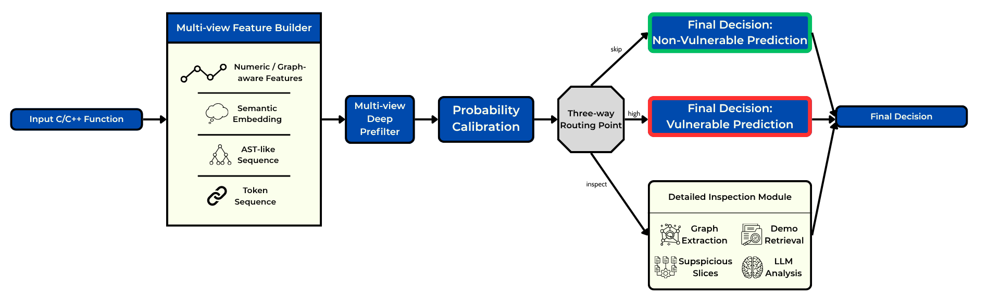

# VulGuardVN

VulGuardVN is a research project on function-level vulnerability detection for C/C++ source code. The project rebuilds a GRACE-style vulnerability detection workflow and extends it with a learned multi-view prefilter. The purpose of this extension is to reduce unnecessary detailed LLM analysis while preserving a security-oriented emphasis on high vulnerability recall.

The project is based on the original GRACE paper, [GRACE: Empowering LLM-based software vulnerability detection with graph structure and in-context learning](https://doi.org/10.1016/j.jss.2024.112031), published in Journal of Systems and Software, Volume 212, June 2024, Article 112031. The original paper is also available on [ScienceDirect](https://www.sciencedirect.com/science/article/pii/S0164121224000748), and the official implementation is hosted in the [GRACE GitHub repository](https://github.com/P-E-Vul/GRACE).

## Research Objective

The objective of VulGuardVN is to study a GRACE-inspired hybrid pipeline for binary vulnerability detection on three benchmark datasets used by the original GRACE study: Devign/FFmpeg+Qemu, Big-Vul, and ReVeal. Instead of sending every function directly to the detailed LLM-based inspection stage, this project first estimates vulnerability risk from multiple code representations, calibrates the resulting probability, and routes each sample according to its estimated risk level.

The central research question is whether a multi-view prefilter can improve the efficiency of GRACE-style detection by identifying low-risk and high-risk cases before expensive downstream analysis, while still retaining enough suspicious cases for detailed graph-aware and retrieval-augmented LLM inspection.

## Pipeline Overview

The pipeline starts from a C/C++ function and builds four complementary views: numeric and graph-aware features, semantic embeddings, AST-like sequences, and token sequences. These views are fused by a multi-view deep prefilter that produces a vulnerability probability. A calibration layer then defines a three-way routing policy. Low-risk samples are predicted as non-vulnerable, high-risk samples can be predicted as vulnerable, and uncertain samples are sent to a detailed inspection module. The inspection module combines graph extraction, demonstration retrieval, suspicious-slice localization, and LLM analysis to produce the final decision.

## Datasets

The project uses the three datasets associated with the original GRACE benchmark setting.

| Dataset | Role in the experiment | Link |
| --- | --- | --- |
| Devign/FFmpeg+Qemu | Function-level C/C++ vulnerability benchmark | [GRACE Devign dataset](https://drive.google.com/file/d/1x6hoF7G-tSYxg8AFybggypLZgMGDNHfF/view?usp=sharing) |
| Big-Vul | Large-scale C/C++ vulnerability dataset collected from CVE-linked code changes | [GRACE Big-Vul dataset](https://drive.google.com/file/d/1-0VhnHBp9IGh90s2wCNjeCMuy70HPl8X/view?usp=sharing) |
| ReVeal | Real-world deep-learning vulnerability detection benchmark | [ReVeal on Hugging Face](https://huggingface.co/datasets/claudios/ReVeal) |

The notebook also includes fallback sources for reproducible Kaggle execution: [CodeXGLUE Devign mirror](https://raw.githubusercontent.com/madlag/CodeXGLUE/main/Code-Code/Defect-detection/dataset/function.json) and [Big-Vul on Hugging Face](https://huggingface.co/datasets/bstee615/bigvul). ReVeal uses the Hugging Face mirror directly because the Google Drive folder listed by the GRACE repository is unavailable.

## Method

VulGuardVN follows a compact GRACE-style hybrid design.

1. Normalize source-code records from the target datasets into a shared function-level schema.
2. Build reproducible train, validation, and test splits.
3. Extract multi-view features from each function, including lexical, syntactic, semantic, and graph-aware information.
4. Train a dataset-specific hybrid prefilter to estimate vulnerability probability.
5. Calibrate validation probabilities and define routing thresholds for low-risk, uncertain, and high-risk samples.
6. Apply retrieval-augmented and graph-aware LLM inspection only to samples that require detailed analysis.
7. Evaluate binary vulnerability detection using accuracy, precision, recall, F1, ROC-AUC, PR-AUC, and LLM call ratio.

## Environment and Models

The main experiment is implemented in `GRACE-improve/baseline/baseline2/FINAL.ipynb` and is designed to run on Kaggle. The default semantic encoder is [microsoft/unixcoder-base-nine](https://huggingface.co/microsoft/unixcoder-base-nine). The default local LLM is [unsloth/Qwen2.5-Coder-7B-Instruct-bnb-4bit](https://huggingface.co/unsloth/Qwen2.5-Coder-7B-Instruct-bnb-4bit). Graph extraction uses an automatic backend: Joern when available, otherwise a heuristic graph extractor.
