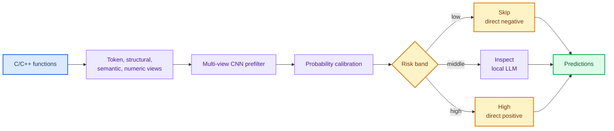

# VulGuardVN

VulGuardVN is a function-level C/C++ vulnerability-detection research pipeline. It extends a GRACE-style graph-aware, retrieval-augmented workflow with a calibrated multi-view prefilter that decides which functions require local-LLM inspection.

The repository releases prediction-level artifacts for **Devign** and aggregate result summaries for **BigVul** and **ReVeal**. Record-level outputs for the latter two datasets are not committed because they are substantially larger.

**Paper:** [Deep Learning-Assisted Pre-Filtering for Selective Graph-Structured LLM-Based Vulnerability Detection](1571309665.pdf)


## Public Artifacts

| Artifact | Path | Role |
| --- | --- | --- |
| Main notebook | [full_pipeline.ipynb](full_pipeline.ipynb) | Canonical Kaggle-oriented pipeline; defaults to Devign and allows opt-in Big-Vul/ReVeal runs. |
| Devign notebook | [GRACE-improve/grace-improve-devign.ipynb](GRACE-improve/grace-improve-devign.ipynb) | Devign-scoped copy of the pipeline with stage logging and prediction/evaluation export. |
| Big-Vul notebook | [GRACE-improve/grace-improve-bigvul.ipynb](GRACE-improve/grace-improve-bigvul.ipynb) | Big-Vul-scoped copy of the pipeline with stage logging and prediction/evaluation export. |
| ReVeal notebook | [GRACE-improve/grace-improve-reveal.ipynb](GRACE-improve/grace-improve-reveal.ipynb) | ReVeal-scoped copy of the pipeline with stage logging and prediction/evaluation export. |
| Released results | [outputs/](outputs/) | Devign record-level predictions and run-state, plus summaries for all three datasets. |
| Run-seed metrics | [outputs/runseed_metrics.csv](outputs/runseed_metrics.csv) | Historical per-run metrics for five repetitions, five seeds, and three datasets. |
| BigVul summary | [outputs/bigvul_results_summary.json](outputs/bigvul_results_summary.json) | Aggregate metrics and routing counts. |
| ReVeal summary | [outputs/reveal_results_summary.json](outputs/reveal_results_summary.json) | Aggregate metrics and routing counts. |
| Stage scripts | [GRACE-improve/baseline/baseline2/](GRACE-improve/baseline/baseline2/) | Script implementation from asset verification through evaluation. |
| Pipeline figure | [figures/pipeline_overview.png](figures/pipeline_overview.png) | Static pipeline overview. |
| GRACE reference material | [GRACE-main/](GRACE-main/) | Upstream paper and retained reference implementation. |

## Released Results

The three released summaries use the same metric and routing field names. The BigVul and ReVeal values were converted from aggregate run outputs; they were not recomputed from record-level predictions.

| Dataset | Samples | Accuracy | Precision | Recall | F1 | ROC-AUC | PR-AUC | LLM call ratio |
| --- | ---: | ---: | ---: | ---: | ---: | ---: | ---: | ---: |
| Devign | 2,726 | 0.5723 | 0.5214 | 0.9462 | 0.6723 | 0.6986 | 0.6484 | 12.77% |
| BigVul | 21,709 | 0.9186 | 0.3350 | 0.5000 | 0.4012 | 0.8420 | 0.3890 | 93.17% |
| ReVeal | 2,274 | 0.8492 | 0.5447 | 0.5000 | 0.5214 | 0.8290 | 0.4226 | 86.90% |

The Devign snapshot contains 2,726 complete test predictions. Its confusion matrix is `TP=1196`, `TN=364`, `FP=1098`, and `FN=68`. This is a recall-oriented operating point; the high false-positive count is material and should be reported with the headline metrics.

The released run used isotonic calibration with `tau_low=0.130435` and `tau_high=0.266667`. It routed 98 records to direct negative decisions, 348 to local-LLM inspection, and 2,280 to direct positive decisions. The mean generation latency was approximately 12.55 seconds per LLM call.

BigVul and ReVeal do not include record-level predictions, confusion counts, calibration diagnostics, timing details, or run signatures. Their JSON summaries mark these unavailable fields explicitly rather than estimating them.

`outputs/runseed_metrics.csv` contains 75 rows = 5 repetitions × 5 seeds × 3 datasets. `dataset` identifies the evaluated dataset; `repetition` identifies the repeated experiment; `seed` is the run seed; and `test_samples` is the number of evaluated test records. `accuracy`, `precision`, `recall`, and `f1` describe the final pipeline decisions. `prefilter_roc_auc` and `prefilter_pr_auc` are ranking metrics computed from the calibrated prefilter probabilities, not from the final discrete pipeline decisions. `llm_call_ratio` is the fraction of test records routed to the local LLM.

## Multi-Seed Robustness Check

In addition to the released Devign snapshot above, the full Devign pipeline was rerun with seeds **1, 7, 21, 42, and 100**. Each seed was applied to the data split, prefilter training, and demonstration sampling. The resulting test splits contain slightly different numbers of samples, so these runs should be read as a robustness check rather than as repeated evaluation on one fixed test set.

| Seed | Samples | Accuracy | Precision | Recall | F1 | ROC-AUC | PR-AUC | LLM call ratio |
| ---: | ---: | ---: | ---: | ---: | ---: | ---: | ---: | ---: |
| 1 | 2,733 | 0.5774 | 0.5192 | 0.9258 | 0.6653 | 0.7008 | 0.6361 | 16.14% |
| 7 | 2,732 | 0.5860 | 0.5199 | 0.9012 | 0.6594 | 0.6893 | 0.6114 | 16.76% |
| 21 | 2,732 | 0.5985 | 0.5321 | 0.8893 | 0.6659 | 0.7000 | 0.6314 | 21.89% |
| 42 | 2,726 | 0.5712 | 0.5207 | 0.9454 | 0.6715 | 0.6986 | 0.6484 | 12.77% |
| 100 | 2,734 | 0.5805 | 0.5209 | 0.9452 | 0.6716 | 0.7038 | 0.6491 | 14.30% |
| **Mean +/- SD** | - | **0.5827 +/- 0.0103** | **0.5226 +/- 0.0054** | **0.9214 +/- 0.0255** | **0.6668 +/- 0.0051** | **0.6985 +/- 0.0055** | **0.6353 +/- 0.0154** | **16.37% +/- 3.46%** |

Across the five runs, F1 remains within `0.6594-0.6716` and ROC-AUC within `0.6893-0.7038`. This suggests that the overall Devign result is not dependent on a single favorable seed, although recall and the proportion of samples routed to the LLM vary more noticeably. These values come from the execution logs in the multi-seed notebook and are reported separately from the committed Devign prediction snapshot.

Complete BigVul and ReVeal run directories were not added to the repository because their prediction exports, feature stores, graph caches, and intermediate model artifacts are too large for practical Git hosting. To keep the repository lightweight and reviewable, the available aggregate summaries are retained under `outputs/`, while claims for those two datasets are deliberately limited to aggregate-level results. This packaging decision should not be interpreted as prediction-level reproducibility: independent per-record auditing would require the corresponding external artifacts.

## Method Summary


```mermaid
flowchart LR
    accTitle: VulGuardVN Decision Flow
    accDescr: Four prefilter views produce a calibrated score. Low and high bands receive direct decisions, while the inspect band is sent to a local LLM under the released Devign policy.

    functions["C/C++ functions"]
    views["Token, structural,<br/>semantic, numeric views"]
    prefilter["Multi-view CNN prefilter"]
    calibration["Probability calibration"]
    routing{"Risk band"}
    skip["Skip<br/>direct negative"]
    inspect["Inspect<br/>local LLM"]
    high["High<br/>direct positive"]
    results["Predictions"]

    functions --> views
    views --> prefilter
    prefilter --> calibration
    calibration --> routing
    routing -->|low| skip
    routing -->|middle| inspect
    routing -->|high| high
    skip --> results
    inspect --> results
    high --> results

    classDef input fill:#dbeafe,stroke:#2563eb,stroke-width:2px,color:#1e3a5f
    classDef model fill:#ede9fe,stroke:#7c3aed,stroke-width:1px,color:#4c1d95
    classDef decision fill:#fef3c7,stroke:#d97706,stroke-width:2px,color:#78350f
    classDef output fill:#dcfce7,stroke:#16a34a,stroke-width:2px,color:#14532d

    class functions input
    class views,prefilter,calibration,inspect model
    class routing,skip,high decision
    class results output
```

The prefilter combines four views:

| View | Implementation |
| --- | --- |
| Token sequence | Embedding, two `Conv1D` layers, and global max pooling. |
| Structural sequence | An AST-like linearization encoded by a lightweight CNN. |
| Semantic embedding | Precomputed UniXcoder embeddings with a dense projection. |
| Numeric summary | Twenty-four code and graph scalar features. |

The default prefilter uses Adam with learning rate `7e-4`, batch size 128, at most 10 epochs, dropout 0.25, and seed 42. Binary cross-entropy is the default loss; focal loss and hard-negative mining are optional rather than part of every run.

This is not an end-to-end GNN. Graph structure comes from Joern when available and otherwise from a heuristic fallback. The calibrated score is routed into `skip`, `inspect`, and `high` bands:

| Band | Condition | Default action |
| --- | --- | --- |
| `skip` | `p <= tau_low` | Direct negative |
| `inspect` | `tau_low < p < tau_high` | Call the local LLM when enabled |
| `high` | `p >= tau_high` | Direct positive unless high-band inspection is enabled |

The local verifier receives source code, suspicious slices, graph summaries, calibrated scores, and retrieved demonstrations. The released Devign run inspected only the middle band, used the heuristic graph backend for all 348 LLM calls, and did not enable evidence-enforced verification.

## Run the Notebook

The first configuration cell in [full_pipeline.ipynb](full_pipeline.ipynb) defaults to:

```python
DATASET_NAMES = ["devign"]
REQUIRE_ALL_DATASETS = False
```

To run a larger dataset, opt in explicitly:

```python
DATASET_NAMES = ["bigvul"]  # or ["reveal"]
```

For a multi-dataset run:

```python
DATASET_NAMES = ["devign", "bigvul", "reveal"]
REQUIRE_ALL_DATASETS = True
```

The default notebook keeps TensorFlow prefilter work off the GPU so accelerator memory remains available for UniXcoder and the quantized local LLM. Restart the notebook kernel before a full run after changing device settings.

The inference stage writes both JSONL and UTF-8-with-BOM CSV predictions. Full BigVul and ReVeal prediction artifacts can be too large for ordinary Git hosting and should be stored as release assets or in an external artifact repository.

The E01 rerun harness defaults to isolated handoff directories under `outputs/rerun_2408/{dataset}/{seed}/{arm}/`, where `arm` is `baseline` or `selective`. Each arm retains `predictions.jsonl`, calibration thresholds and calibrator state, `config.json`, `run_metadata.json` (including commit and split provenance), `metrics.json`, `runtime.json`, and its private `_pipeline/` checkpoints/caches. Prediction rows use `record_id`, `ground_truth`, and the canonical final-decision field `prediction`; routing fields include `risk_band`, `decision_source`, `llm_called`, and `calibrated_probability`. The paired evaluator requires identical record-ID sets and matching ground-truth labels between the two arms before computing comparisons.

## Reproducibility and Limitations

The committed Devign package supports prediction-level auditing, not complete training reproduction. It includes predictions, run configuration, metrics, routing fields, and latency fields. The BigVul and ReVeal packages support aggregate reporting only. The repository does not include:

- raw datasets or exact generated splits;
- feature stores and graph caches;
- trained prefilter weights and vocabularies;
- calibration files and the demonstration bank;
- local model snapshots;
- baseline predictions aligned by `record_id`.

The historical released snapshot used seed 42 for dataset splitting, prefilter training, demonstration sampling, and F1 bootstrap; its inner split used seed 43. For the new E01 protocol, each run seed in `{1, 7, 21, 42, 100}` is assigned to both `GRACE_SPLIT_SEED` and `GRACE_PREFILTER_RANDOM_SEED`. Baseline and Selective therefore share one partition within a seed, while generated grouped partitions may vary across seeds. ReVeal still preserves official or valid source-provided splits when available, so its resolved split seed is recorded as null when random splitting did not determine the partition. Local-LLM decoding uses temperature 0.0. These settings reduce variation but do not guarantee bitwise determinism across TensorFlow, PyTorch, CUDA, model-library, and backend versions.

Because no aligned baseline predictions are released, the repository does not currently support McNemar or paired-bootstrap superiority claims. The BigVul and ReVeal summaries are evidence only for the reported aggregate values; they do not permit independent metric recomputation or prediction-level error analysis.

## Datasets

| Dataset | Supported source |
| --- | --- |
| Devign | GRACE Google Drive source with a CodeXGLUE mirror fallback |
| Big-Vul | GRACE CSV source or Hugging Face parquet fallback |
| ReVeal | Hugging Face parquet or supported local split directories |

Raw datasets and generated splits are intentionally not committed. Consult `datasets.py` and the notebook configuration cell for accepted local paths.

## Models and Backends

The default semantic encoder is `microsoft/unixcoder-base-nine`. The default local verifier is `unsloth/Qwen2.5-Coder-7B-Instruct-bnb-4bit`.

Retrieval can fall back to TF-IDF when the semantic encoder is unavailable in `auto` mode. Graph extraction can fall back from Joern to the heuristic extractor. Any experiment report must disclose the resolved backends rather than only the requested `auto` settings.

## Research Provenance

VulGuardVN builds on [GRACE: Empowering LLM-based software vulnerability detection with graph structure and in-context learning](https://doi.org/10.1016/j.jss.2024.112031). The upstream implementation is available from the [GRACE repository](https://github.com/P-E-Vul/GRACE).

The released run artifacts did not record a Git commit SHA, package lock, or hardware manifest. A future archival release should pin a tag or commit and publish the heavy model, split, calibration, prediction, and environment artifacts outside Git.
